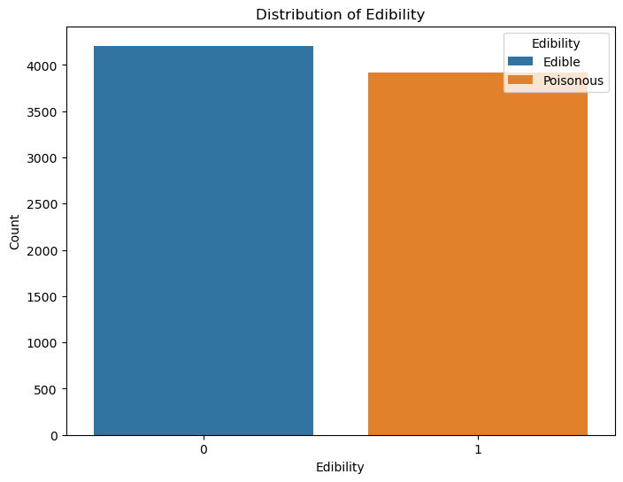
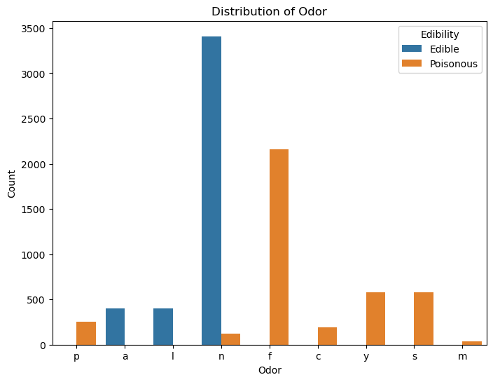
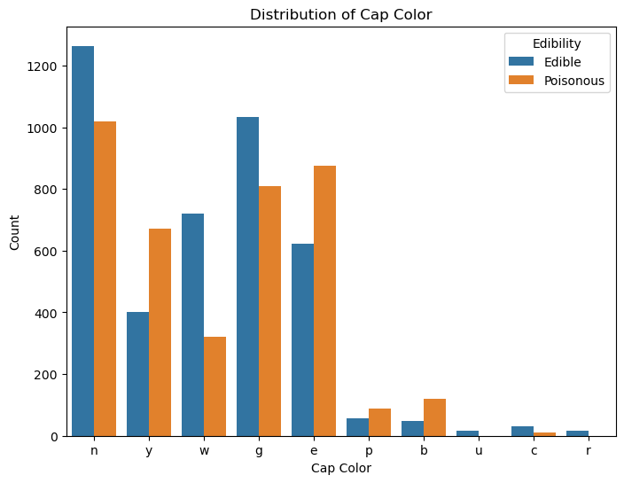
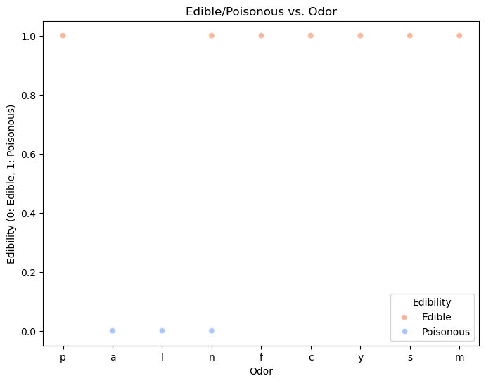
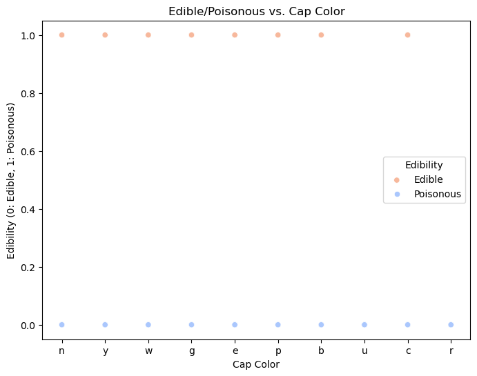

```python
import pandas as pd
import matplotlib.pyplot as plt
import seaborn as sns
```


```python
# Load the dataset
mushroom_data = pd.read_csv("mushroom_data.csv")
```


```python
# Check the column names in your DataFrame
print(mushroom_data.columns)
# Subset the columns: target, odor, and cap-color
subset_columns = ['class', 'odor', 'cap-color']
mushroom_subset = mushroom_data[subset_columns].copy()
```

    Index(['class', 'cap-shape', 'cap-surface', 'cap-color', 'bruises', 'odor',
           'gill-attachment', 'gill-spacing', 'gill-size', 'gill-color',
           'stalk-shape', 'stalk-root', 'stalk-surface-above-ring',
           'stalk-surface-below-ring', 'stalk-color-above-ring',
           'stalk-color-below-ring', 'veil-type', 'veil-color', 'ring-number',
           'ring-type', 'spore-print-color', 'population', 'habitat'],
          dtype='object')


```python
# Rename columns
mushroom_subset.columns = ['Edibility', 'Odor', 'Cap Color']
```


```python
# Replace codes with numeric values
# Assuming 'e' (edible) becomes 0 and 'p' (poisonous) becomes 1 in the 'Edibility' column
mushroom_subset['Edibility'] = mushroom_subset['Edibility'].replace({'e': 0, 'p': 1})
```


```python
# Plot distribution of each column
for col in mushroom_subset.columns:
    plt.figure(figsize=(8, 6))
    sns.countplot(data=mushroom_subset, x=col, hue='Edibility')
    plt.title(f'Distribution of {col}')
    plt.xlabel(col)
    plt.ylabel('Count')
    plt.legend(title='Edibility', labels=['Edible', 'Poisonous'])
    plt.show()
```


    

    


    

    


    

    


```python
# Scatterplot for Edible/Poisonous vs. Odor
plt.figure(figsize=(8, 6))
sns.scatterplot(data=mushroom_subset, x='Odor', y='Edibility', hue='Edibility', palette='coolwarm')
plt.title('Edible/Poisonous vs. Odor')
plt.xlabel('Odor')
plt.ylabel('Edibility (0: Edible, 1: Poisonous)')
plt.legend(title='Edibility', labels=['Edible', 'Poisonous'])
plt.show()
```


    

    


```python
# Scatterplot for Edible/Poisonous vs. Cap Color
plt.figure(figsize=(8, 6))
sns.scatterplot(data=mushroom_subset, x='Cap Color', y='Edibility', hue='Edibility', palette='coolwarm')
plt.title('Edible/Poisonous vs. Cap Color')
plt.xlabel('Cap Color')
plt.ylabel('Edibility (0: Edible, 1: Poisonous)')
plt.legend(title='Edibility', labels=['Edible', 'Poisonous'])
plt.show()
```


    

    


```python
print('''
# Preliminary conclusions
From the scatterplots, it seems that odor is a significant predictor of whether a mushroom is edible or poisonous,
as there are distinct clusters for different odor types. However, the relationship between cap color and
edibility is less clear, as there is significant overlap between edible and poisonous mushrooms across different
cap colors. Therefore, odor may be a more useful feature for predicting edibility compared to cap color.

''')
```

    
    # Preliminary conclusions
    From the scatterplots, it seems that odor is a significant predictor of whether a mushroom is edible or poisonous,
    as there are distinct clusters for different odor types. However, the relationship between cap color and
    edibility is less clear, as there is significant overlap between edible and poisonous mushrooms across different
    cap colors. Therefore, odor may be a more useful feature for predicting edibility compared to cap color.
    
    


```python

```
